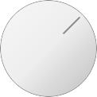

# Web-Components

Collection of fun controls and widgets using technologies that are fully native to the browser.

---

## [Knob](./knob/readme.md)

Rotatable knob input, that can simulate variety of different devices.

[`<demo />`](https://scheibig.github.io/Web-Components/knob/)
